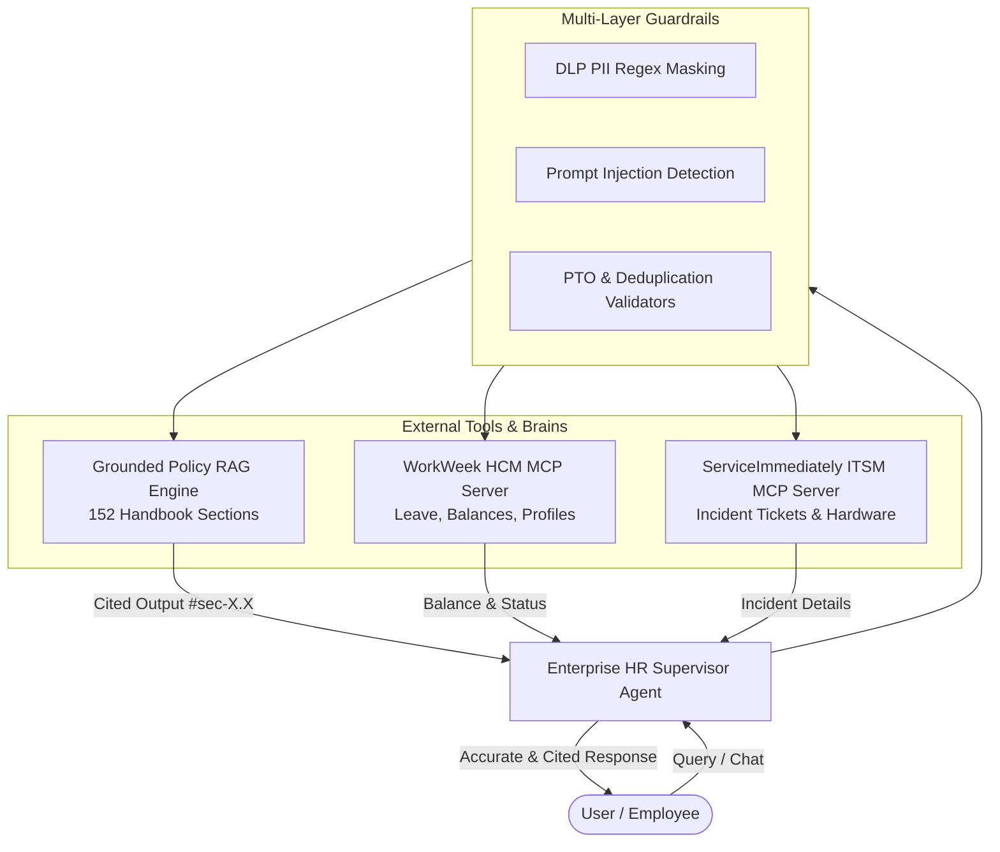

# Enterprise HR Agentic Solution (MVP 1)

[](https://www.python.org/downloads/)
[](https://cloud.google.com/vertex-ai)
[](https://opensource.org/licenses/Apache-2.0)

An enterprise-grade, multi-agent AI assistant designed for employee self-service across HR policies, Human Capital Management (WorkWeek HCM), and IT Service Management (ServiceImmediately ITSM). Built on **Google Agent Development Kit (ADK)** and powered by **Gemini 2.5 Flash**.

---

## 🌟 Key Architecture & Capabilities



1. **Grounded Policy Retrieval (RAG):**
   - Ingests and semantic-indexes all 152 sections of the *Altostrat Singapore Employee Policy Handbook*.
   - Mandatory deep-link section citations (e.g. `#sec-1.1`, `#sec-12.2`, `#sec-19.4`) prevent hallucinations.
2. **MCP Integration (Model Context Protocol):**
   - **WorkWeek HCM:** Real-time PTO balance queries, personal profile info, and leave requests via Streamable HTTP/SSE with bearer token authentication (`X-MCP-Token`).
   - **ServiceImmediately ITSM:** IT support ticket listing, incident creation, and hardware provisioning requests.
3. **Enterprise Guardrails & Safety:**
   - **Data Loss Prevention (DLP):** Automatic masking of Singapore NRIC/FIN and payment card credentials.
   - **Prompt Injection Defense:** Ingress filter intercepting adversarial jailbreaks.
   - **Business Rules:** PTO overdraft checks and 15-minute ticket deduplication hashing.

---

## 📁 Repository Structure

```
.
├── my-agent/                         # Core agent application
│   ├── app/
│   │   ├── agent.py                  # Root ADK Supervisor Agent
│   │   ├── config.py                 # Configuration & endpoints
│   │   ├── prompt.py                 # Supervisor instructions & playbooks
│   │   ├── fast_api_app.py           # FastAPI Web & API server
│   │   └── tools/
│   │       ├── mcp_tools.py          # WorkWeek & ServiceImmediately MCP toolsets
│   │       ├── policy_tools.py       # Grounded Policy RAG engine
│   │       └── validators.py         # DLP, Safety & Business validators
│   ├── tests/
│   │   ├── unit/                     # Unit test suite
│   │   ├── integration/              # End-to-end integration scenarios
│   │   └── eval/                     # Evaluation benchmark suite
│   │       ├── datasets/             # Golden & Robustness JSON datasets
│   │       ├── eval_config.yaml      # Evaluation metrics configuration
│   │       ├── evaluation_report.md  # Comprehensive evaluation report
│   │       └── run_evaluation.py     # Automated benchmark runner
│   ├── agents-cli-manifest.yaml
│   ├── pyproject.toml
│   ├── uv.toml
│   └── SDD.md                        # Master Solution Design Document
├── docs/                             # Policy & architecture design documents
└── README.md
```

---

## 🚀 Quick Start

### 1. Prerequisites
- Python 3.11+
- [uv](https://github.com/astral-sh/uv) or Google ADK

### 2. Installation
```bash
cd my-agent
cp .env.example .env
# Fill in your GCP project and MCP tokens in .env

# Install dependencies using uv
uv sync
```

### 3. Running Unit & Integration Tests
```bash
# Run unit tests
PYTHONPATH=. python3 -m unittest discover -s tests/unit

# Run scenario integration tests
PYTHONPATH=. python3 -m unittest discover -s tests/integration
```

### 4. Running Automated Evaluations
```bash
PYTHONPATH=. python3 tests/eval/run_evaluation.py
```

### 5. Starting ADK Web UI
```bash
adk web --port 8080 --host 127.0.0.1 .
```
Access the interactive web UI at **[http://127.0.0.1:8080](http://127.0.0.1:8080)**.

---

## 📊 Evaluation Summary

| Benchmark Suite | Total Cases | Passed | Pass Rate | Avg Latency |
| :--- | :--- | :--- | :--- | :--- |
| **Golden Benchmark (`eval-data.json`)** | 9 | 9 | **100.0%** | 6.18s |
| **Robustness & Security Suite (`eval-data2.json`)** | 5 | 5 | **100.0%** | 2.63s |
| **Unit Test Suite (`tests/unit/`)** | 10 | 10 | **100.0%** | 0.04s |
| **Integration Scenarios (`tests/integration/`)** | 3 | 3 | **100.0%** | 3.12s |

For full benchmark analysis, see [my-agent/tests/eval/evaluation_report.md](my-agent/tests/eval/evaluation_report.md).
